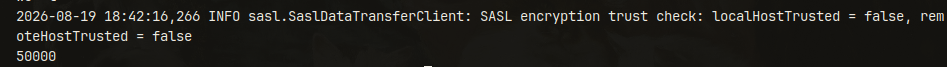
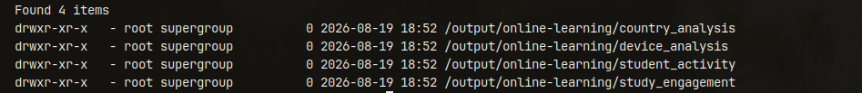

# Online Learning Engagement — Big Data Pipeline

A small, Docker-based Big Data pipeline that ingests a CSV of student engagement records into HDFS with Apache Flume, processes it with Apache Spark, and writes the results back to HDFS as Parquet. Built as a one-day learning project to demonstrate ingestion, storage, and distributed processing working together — not a production system.

## Architecture


```
CSV → Apache Flume → HDFS (raw) → Apache Spark → HDFS (Parquet)
```

Flume watches a spooling directory and streams the CSV into HDFS. Spark then reads that raw data from HDFS, runs the analyses, and writes the results back to HDFS as separate Parquet outputs.

## Technologies

| Technology | Role |
|---|---|
| Apache Flume | Ingests the CSV into HDFS (Spooling Directory Source → Memory Channel → HDFS Sink). |
| HDFS | Distributed storage. NameNode holds file-system metadata; DataNode stores the blocks. |
| Apache Spark (PySpark) | Reads the raw data from HDFS and runs the analyses using the DataFrame API. |
| Docker Compose | Starts the full environment (Hadoop + Flume + Spark) with one command. |

## Dataset

`data/online_learning_engagement_dataset.csv` — the Online Learning Engagement Dataset, roughly 50,000 synthetic student records, one row per student.

Fields used in the analyses:

| Field | Meaning |
|---|---|
| `device_type` | Device used (Laptop / Tablet / Mobile) |
| `country` | Student country |
| `study_hours_weekly` | Weekly study hours |
| `engagement_score` | Engagement score (0–10) |
| `final_grade` | Final grade |
| `login_frequency_weekly` | Logins per week |
| `avg_session_duration_min` | Average session length (minutes) |

## Project Structure

```
.
├── assets
│   ├── Architecture Diagram.png
│   ├── Docker Services.png
│   ├── Flume-to-HDFS.png
│   └── HDFS-Spark-Results.png
├── data
│   └── online_learning_engagement_dataset.csv
├── docker-compose.yml
├── flume
│   ├── Dockerfile
│   ├── flume.conf
│   └── run-agent.sh
├── README.md
└── spark
    └── analysis.py
```

## How It Works

1. **Flume ingestion** — Flume picks up the CSV from its spooling directory and streams each line into HDFS at `hdfs://namenode:8020/data/online-learning/raw/`.
2. **HDFS storage** — the NameNode and DataNode store the raw, ingested data.
3. **Spark processing** — Spark reads the raw data from HDFS and runs four DataFrame-based analyses.
4. **HDFS output** — Spark writes each analysis result back to HDFS as Parquet, under `/output/online-learning/`.

## Running the Project

### Prerequisites

Docker with Docker Compose. Everything else runs in containers.

### Start the environment

```bash
git clone <repository-url>
cd online-learning-bigdata

docker compose up -d --build
docker compose ps
```

`namenode`, `datanode`, `flume`, and `spark` should all show as `Up`.


Flume ingests the dataset automatically on startup.

### Verify ingestion

```bash
docker exec namenode hdfs dfs -ls /data/online-learning/raw/
docker exec namenode hdfs dfs -cat /data/online-learning/raw/* | wc -l
```



The row count should be `50000`.

### Run Spark

```bash
docker compose exec spark spark-submit --master local[2] /app/analysis.py
```

## Monitoring / Web Interfaces

| Interface | URL | Purpose |
|---|---|---|
| HDFS NameNode UI | http://localhost:9870 | Browse the HDFS file system and check DataNode/block status. |

This is the only interface published to the host in `docker-compose.yml`.

## Verification

```bash
# Docker services running
docker compose ps

# Row count in raw HDFS data (expect 50000)
docker exec namenode hdfs dfs -cat /data/online-learning/raw/* | wc -l

# Spark output directories
docker exec namenode hdfs dfs -ls /output/online-learning/
```



## Results

Spark writes four Parquet outputs to `/output/online-learning/`:

- `device_analysis` — average `engagement_score` by `device_type`.
- `country_analysis` — average `final_grade` by `country`.
- `study_engagement` — average engagement by study-hours bucket (low / medium / high).
- `student_activity` — per-student activity summary (logins, session duration, assignments, forum posts).

## Output Content

To inspect the Parquet output produced by Spark:

```bash
docker compose exec spark pyspark
```

Then, in the PySpark shell:

```python
df = spark.read.parquet("hdfs://namenode:8020/output/online-learning/device_analysis")
df.show()
```

The same approach can be used to inspect the other outputs under `/output/online-learning/`:

```text
device_analysis
country_analysis
study_engagement
student_activity
```


## Troubleshooting

- **A container restarts right after startup** — the first run formats HDFS; give the NameNode and DataNode a minute to come up healthy.
- **No data in `/data/online-learning/raw/`** — check `docker logs flume`; the agent waits for the DataNode to be ready before ingesting.
- **Port 9870 already in use** — change the `namenode` port mapping in `docker-compose.yml`.
